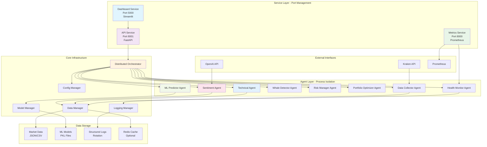
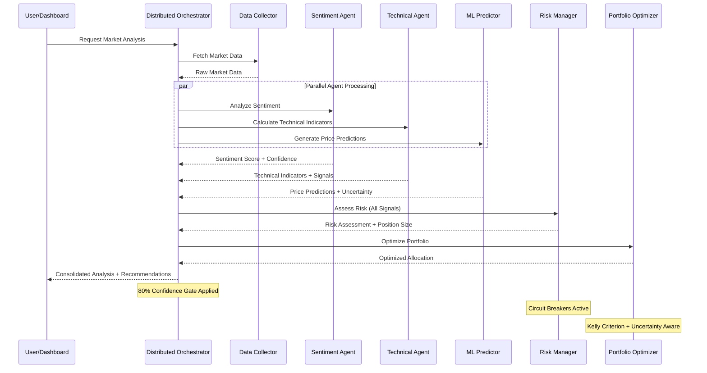
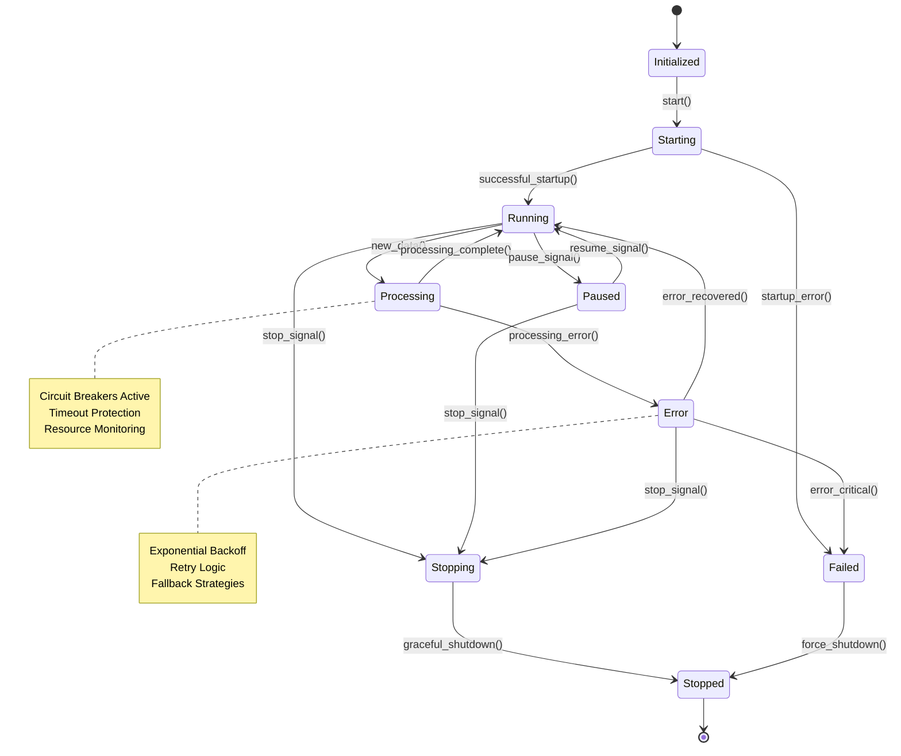
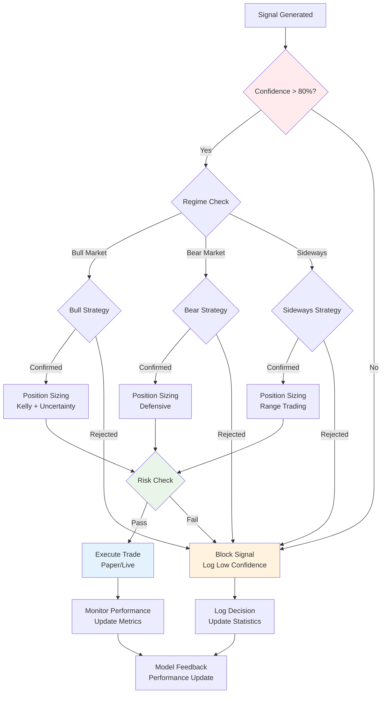
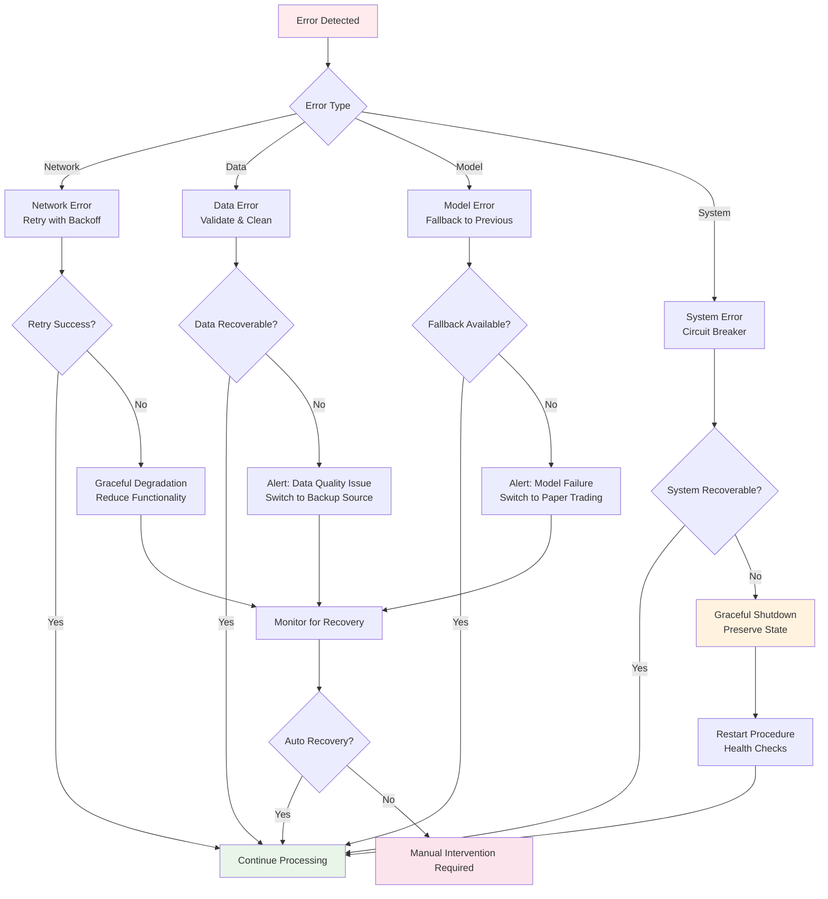
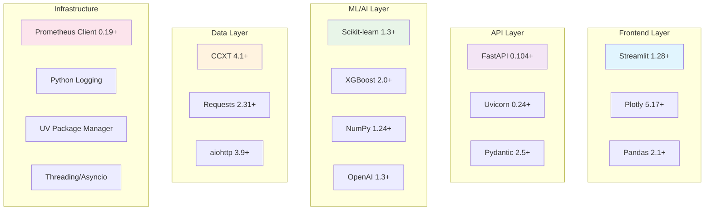

# CryptoSmartTrader V2 - Architecture Diagrams

## System Overview Diagram



## Multi-Agent Communication Flow



## Data Flow Architecture

```mermaid
flowchart LR
    subgraph "Data Sources"
        K[Kraken API<br/>Real-time Market Data]
        N[News APIs<br/>Sentiment Data]
        S[Social Media<br/>Sentiment Signals]
    end
    
    subgraph "Data Pipeline"
        I[Data Ingestion<br/>Rate Limited]
        V[Data Validation<br/>Zero Tolerance Policy]
        T[Temporal Alignment<br/>UTC Sync]
        F[Feature Engineering<br/>Technical Indicators]
    end
    
    subgraph "ML Pipeline"
        FS[Feature Selection<br/>Leakage Detection]
        CV[Cross Validation<br/>Time Series Safe]
        TR[Model Training<br/>Multiple Horizons]
        EN[Ensemble Models<br/>Uncertainty Quantification]
    end
    
    subgraph "Decision Engine"
        CG[Confidence Gate<br/>80% Threshold]
        RR[Regime Router<br/>Market State Aware]
        RS[Risk Sizing<br/>Kelly + Uncertainty]
        EX[Execution<br/>Paper/Live Trading]
    end
    
    subgraph "Monitoring"
        DD[Drift Detection<br/>Statistical Tests]
        PM[Performance Monitoring<br/>Real-time Metrics]
        AL[Alerting<br/>GO/NO-GO Gates]
        LG[Logging<br/>Structured JSON]
    end
    
    K --> I
    N --> I
    S --> I
    
    I --> V
    V --> T
    T --> F
    
    F --> FS
    FS --> CV
    CV --> TR
    TR --> EN
    
    EN --> CG
    CG --> RR
    RR --> RS
    RS --> EX
    
    EN --> DD
    EX --> PM
    PM --> AL
    AL --> LG
    
    style V fill:#ffebee
    style CG fill:#e8f5e8
    style DD fill:#fff3e0
    style EX fill:#e3f2fd
```



## Service Deployment Architecture

```mermaid
graph TB
    subgraph "Replit Environment"
        subgraph "Port 5000 - Public Web Access"
            ST[Streamlit Dashboard<br/>--server.headless true<br/>--server.address 0.0.0.0]
        end
        
        subgraph "Port 8001 - API Services"
            FA[FastAPI Health Service<br/>uvicorn + async]
            HE[/health endpoint]
            HD[/health/detailed endpoint]
            AD[/api/docs - OpenAPI]
        end
        
        subgraph "Port 8000 - Monitoring"
            PM[Prometheus Metrics Server]
            ME[/metrics endpoint]
            MC[Custom Business Metrics]
        end
    end
    
    subgraph "Process Management"
        UV[UV Package Manager<br/>uv sync]
        BG[Background Processes<br/>service1 & service2 & service3]
        WT[Wait Coordination<br/>& wait]
        SH[Signal Handling<br/>Graceful Shutdown]
    end
    
    subgraph "Health Monitoring"
        HS[Health Status Checks]
        AM[Automatic Monitoring]
        RP[Replit Port Panel]
        LR[Log Rotation]
    end
    
    UV --> BG
    BG --> ST
    BG --> FA
    BG --> PM
    BG --> WT
    
    ST --> HS
    FA --> HE
    FA --> HD
    FA --> AD
    PM --> ME
    PM --> MC
    
    HS --> AM
    AM --> RP
    WT --> SH
    SH --> LR
    
    style ST fill:#e1f5fe
    style FA fill:#f3e5f5
    style PM fill:#e8f5e8
    style UV fill:#fff3e0
```

## Agent State Machine



## Confidence Gate Decision Tree



## Error Handling & Recovery Flow



---

## Component Interaction Matrix

| Component | Data Collector | Sentiment Agent | Technical Agent | ML Predictor | Risk Manager | Portfolio Optimizer | Health Monitor |
|-----------|---------------|-----------------|-----------------|--------------|--------------|-------------------|----------------|
| **Data Collector** | - | Market Data | Market Data | Market Data | Market Data | Market Data | Status |
| **Sentiment Agent** | - | - | Sentiment Scores | Sentiment Features | Sentiment Risk | Sentiment Weights | Agent Health |
| **Technical Agent** | - | - | - | Technical Features | Technical Signals | Technical Weights | Agent Health |
| **ML Predictor** | - | Prediction Context | Technical Context | - | Predictions + Uncertainty | Expected Returns | Model Performance |
| **Risk Manager** | Risk Metrics | Sentiment Risk | Technical Risk | Model Risk | - | Risk Constraints | Risk Status |
| **Portfolio Optimizer** | Portfolio Data | Sentiment Alpha | Technical Alpha | Return Predictions | Risk Constraints | - | Optimization Status |
| **Health Monitor** | Data Quality | Agent Status | Agent Status | Model Performance | Risk Metrics | Portfolio Health | - |

---

## Technology Stack Detail



This architecture ensures:
- **Scalability:** Independent service scaling
- **Reliability:** Circuit breakers and health monitoring
- **Maintainability:** Clear separation of concerns  
- **Performance:** Async processing and caching
- **Observability:** Comprehensive logging and metrics